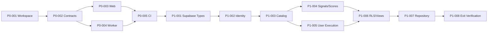

# Airdrop Intelligence OS — Phase 0/1 开发任务书

**版本：** V1.0  
**日期：** 2026-08-09  
**适用范围：** Codex / 开发者执行 Phase 0 与 Phase 1  
**上位规则：** `AGENTS.md`  
**详细步骤：** `docs/superpowers/plans/2026-08-09-airdrop-intelligence-phase-0-1.md`

## 1. 执行约定

每张任务卡必须按以下顺序执行：

```text
领取任务
→ 检查依赖与工作区
→ 先写失败测试
→ 确认失败原因正确
→ 最小实现
→ 跑局部测试
→ 跑任务验收命令
→ 自查安全与范围
→ 提交单一 commit
```

状态仅使用：`READY`、`IN_PROGRESS`、`BLOCKED`、`REVIEW`、`DONE`。

任务进入 `DONE` 必须同时满足：

- 对应测试先红后绿。
- 任务验收命令退出码为 `0`。
- 无未完成标记、跳过测试或静默捕获错误。
- 无真实密钥、钱包、合约、个人数据进入代码或 fixture。
- 数据库变更同时包含迁移、RLS、pgTAP 测试和生成类型更新。
- `git diff` 只包含任务范围内的文件。
- Commit subject 与任务卡一致。

## 2. 里程碑与依赖



| ID | 任务 | 依赖 | 预计粒度 | 验收入口 |
|---|---|---|---:|---|
| P0-001 | Monorepo 与质量基线 | 无 | 0.5–1 天 | `pnpm check:placeholders` |
| P0-002 | Contracts 与 Domain | P0-001 | 1 天 | 两个包的 typecheck/test |
| P0-003 | Web Shell 与 Health API | P0-002 | 0.5–1 天 | Web lint/typecheck/test/build |
| P0-004 | Worker Shell 与生命周期 | P0-002 | 0.5 天 | Worker lint/typecheck/test/build |
| P0-005 | CI、架构说明、运行手册 | P0-003、P0-004 | 0.5 天 | `pnpm verify` |
| P1-001 | Supabase 扩展与枚举 | P0-005 | 0.5 天 | `pnpm test:db` |
| P1-002 | Profile、Role、Identity RLS | P1-001 | 1 天 | Identity pgTAP |
| P1-003 | Project/Source Catalog | P1-002 | 1 天 | Catalog pgTAP |
| P1-004 | Signal/Score History | P1-003 | 1 天 | History pgTAP |
| P1-005 | Watchlist/User Project/Task | P1-003 | 1 天 | Execution pgTAP |
| P1-006 | RLS 矩阵与 Read Models | P1-004、P1-005 | 1 天 | Policy/View pgTAP |
| P1-007 | Database Types 与 Repository | P1-006 | 1 天 | Repository integration |
| P1-008 | Seed、文档与总验收 | P1-007 | 0.5 天 | `pnpm verify:full` |

预计粒度用于拆分工作，不是交付承诺；测试失败和安全问题优先于进度。

## 3. Phase 0 任务卡

### P0-001 — Monorepo 与质量基线

**状态：** DONE

**目标：** 空目录可通过冻结锁文件安装，并具备统一 lint、typecheck、test、build、占位符扫描命令。

**创建：**

```text
package.json
pnpm-workspace.yaml
pnpm-lock.yaml
tsconfig.base.json
eslint.config.mjs
prettier.config.mjs
vitest.workspace.ts
.npmrc
.gitignore
.env.example
README.md
scripts/check-placeholders.mjs
scripts/verify-env.mjs
```

**测试：** 环境变量缺失时仅打印变量名并返回 `1`；给出临时值时返回 `0`；占位符扫描能识别禁止标记。

**验收：**

```bash
pnpm install --frozen-lockfile
pnpm check:placeholders
```

**不得包含：** 业务页面、数据库表、OpenAI SDK、队列消费者。

**Commit：** `chore: bootstrap monorepo foundation`

### P0-002 — Contracts 与纯 Domain

**状态：** DONE

**目标：** 建立 API/Job 唯一契约来源和不依赖基础设施的领域原语。

**创建：** `packages/contracts/**`、`packages/domain/**`。

**必须测试：** 严格对象、未知字段、错误版本、无效 UUID/时间、空幂等键、项目生命周期、推荐枚举。

**验收：**

```bash
pnpm --filter @airdrop/contracts typecheck
pnpm --filter @airdrop/contracts test
pnpm --filter @airdrop/domain typecheck
pnpm --filter @airdrop/domain test
```

**接口冻结：** `ApiSuccess<T>`、`ApiError`、`JobEnvelope<TType, TPayload>`、品牌 ID parsers。

**Commit：** `feat(contracts): add api job and domain primitives`

### P0-003 — Web Shell 与 Health API

**状态：** DONE

**目标：** Next.js 应用可构建，`GET /api/v1/health` 遵循共享 envelope。

**创建：** `apps/web/**`，包括 root layout/page、环境解析、Route Handler 和 contract test。

**响应约束：** `service=web`、`status=healthy`、每请求 UUID、`nextCursor=null`；不返回版本、环境、数据库或凭据细节。

**验收：**

```bash
pnpm --filter @airdrop/web lint
pnpm --filter @airdrop/web typecheck
pnpm --filter @airdrop/web test
pnpm --filter @airdrop/web build
```

**Commit：** `feat(web): add application shell and health endpoint`

### P0-004 — Worker Shell 与进程生命周期

**状态：** DONE

**目标：** Worker 具备可测试的 `starting/ready/stopping` 状态和安全退出。

**创建：** `apps/worker/**`。

**必须测试：** 注入时钟、合法状态转换、禁止 `stopping -> ready`、SIGTERM 后退出码 `0`。

**验收：**

```bash
pnpm --filter @airdrop/worker lint
pnpm --filter @airdrop/worker typecheck
pnpm --filter @airdrop/worker test
pnpm --filter @airdrop/worker build
```

**不得包含：** 队列实现、采集器、模型调用、数据库长事务。

**Commit：** `feat(worker): add lifecycle-safe worker shell`

### P0-005 — CI、架构说明与本地 Runbook

**状态：** DONE

**目标：** 新环境可依据文档完成安装、验证、启动和停止；PR 自动执行质量门。

**创建：** `.github/workflows/ci.yml`、`docs/architecture/phase-0-1.md`、`docs/runbooks/local-development.md`。

**CI Jobs：** `verify` 与 `database-integration` 分离；冻结安装；缓存 pnpm store；不缓存 `node_modules`。

**验收：**

```bash
pnpm install --frozen-lockfile
pnpm verify
```

**Commit：** `ci: enforce repository quality gates`

## 4. Phase 1 迁移任务卡

### P1-001 — Extensions 与 Enum

**状态：** DONE

**迁移：** `20260809000100_extensions_and_types.sql`

**内容：** `pgcrypto`；`app_role`、`project_lifecycle`、`source_type`、`source_status`、`signal_verification`、`signal_lifecycle`、`risk_level`、`recommendation`、`participation_status`、`task_status`、`task_priority`。

**契约：** `packages/contracts` 是 11 个枚举 Schema/Type 的唯一定义源；`packages/domain` 仅保留同一 Schema 实例的兼容性重导出。

**测试：** `001_schema.test.sql` 精确验证 `pgcrypto` 位于 `extensions` Schema 以及枚举值/顺序。

**验收：** `pnpm db:start && pnpm test:db`

**Commit：** `feat(db): add extensions and domain enums`

### P1-002 — Identity、Role History 与 RLS

**状态：** DONE

**迁移：** `20260809000200_identity.sql`

**表：** `profiles`、`user_roles`。  
**函数：** `handle_new_user()`、`has_active_role(app_role)`、`set_updated_at()`。  
**测试：** `002_identity_rls.test.sql` 覆盖匿名、本人、他人、admin、service role；验证 revoked role 无效；通过 `001 -> pre-existing auth user -> 002` 升级路径验证 profile 幂等回填。

**安全条件：** security-definer 固定 `search_path`；普通用户不能授权；角色记录只追加/撤销，不删除；`user_id` 与 `granted_by` 外键均使用 `ON DELETE RESTRICT`，不允许删除 grant owner 或静默丢失 grant provenance。

**验收：** `pnpm test:db`

**Commit：** `feat(auth): add profiles roles and identity policies`

### P1-003 — Project 与 Source Catalog

**状态：** DONE

**迁移：** `20260809000300_catalog.sql`

**表：** `projects`、`sources`、`project_sources`。  
**索引：** lifecycle、source status、source relation、authority domain GIN。  
**测试：** slug/URL/分数/官方来源完整性约束；公开只读；普通用户与浏览器 admin 均不可写 canonical catalog。

**安全边界：** 公开角色只能显式读取 active catalog 安全列，不开放候选官方 URL、canonical URL 或 verifier identity；`service_role` 仅后端只读，canonical DML 在 Promotion Service + audit + transactional outbox 落地前保持关闭。

**URL 契约：** 当前阶段仅接受 HTTPS + canonical lowercase DNS host，禁止 userinfo、IP/IPv6 literal、非法 DNS label 和 1..65535 以外的显式端口。

**更新时钟：** material update 使用严格单调 `updated_at`；no-op 保持时间和版本，时间上界耗尽时 fail closed。

**验收：** `pnpm test:db`

**Commit：** `feat(db): add secured project and source catalog`

### P1-004 — Signal 与 Project Score History

**状态：** DONE

**迁移：** `20260809000400_intelligence_and_scores.sql`

**表：** `signals`、`project_scores`。  
**幂等：** score unique `(project_id, model_version, input_version)`。  
**历史：** 不开放 insert/update/delete/truncate；修正使用同项目 superseding signal 或新 input version。

**测试：** 分数边界、过期时间、自引用/跨项目引用、重复输入、published time、published-only read、全主体 mutation denial。

**安全边界：** browser 仅可读取 active project 的 published signal；raw score 仅后端读取。`service_role` 在 Promotion Service、audit 与 transactional outbox 落地前保持 canonical history 只读。

**验收：** `pnpm test:db`

**Commit：** `feat(intelligence): add signal and score history`

### P1-005 — Watchlist、User Project 与 Task

**状态：** DONE

**迁移：** `20260809000500_execution.sql`

**表：** `watchlists`、`watchlist_projects`、`user_projects`、`user_tasks`。  
**函数：** `update_user_task(task_id, expected_version, patch)`；仅允许严格类型化字段，material patch 原子递增版本，no-op 保持版本与时间。
**约束：** 每用户仅一个默认 watchlist；完成任务必须有 `completed_at`；owner 不可被更新。

**测试：** exact schema/FK/ACL、owner/non-owner、跨用户关联、RLS `using`/`with check`、JSON patch 类型、稳定 PT404/PT409、stale version conflict、admin/service role 私密数据拒绝。

**安全边界：** `user_tasks` 不开放直接 UPDATE；authenticated owner 只能通过 fixed-search-path command 更新自己的任务。普通 admin 角色不获得私有数据支持权限，`service_role` 也无表权限或函数 EXECUTE。

**验收：** `pnpm test:db`

**Commit：** `feat(tasks): add private tracking and task ownership`

### P1-006 — RLS Matrix 与 Read Models

**状态：** DONE

**迁移：**

```text
20260809000600_rls.sql
20260809000700_read_models.sql
```

**视图：** `project_current_state`、`opportunity_list`。  
**排序：** 最新 score 使用 `calculated_at desc, id desc`；机会列表使用 `opportunity_score desc, project_id asc`。  
**测试：** 全表 RLS、无 anon mutation、无 broad private read、同时间 tie-break、非 active/rumored 与无分数项目排除、无私有字段泄漏。

**验收：** `pnpm test:db`

**Commit：** `feat(db): add policy matrix and opportunity read models`

### P1-007 — 生成类型与 Project Repository

**创建：** `packages/database/**`；生成 `packages/database/src/generated/database.types.ts`。

**接口：** `ProjectRepository.listOpportunities({ limit, afterScore, afterProjectId })`。  
**约束：** limit `1..100`；browser anon client 与 server-only service client 分入口；不记录凭据。  
**测试：** active/rumored/paused/scored/unscored fixture；顺序；游标无重复、无跳行；snake_case 到 camelCase。

**验收：**

```bash
pnpm db:types
git diff --exit-code packages/database/src/generated/database.types.ts
pnpm --filter @airdrop/database typecheck
pnpm --filter @airdrop/database test
```

**Commit：** `feat(database): add typed opportunity repository`

### P1-008 — Seed 与总验收

**Seed：** 固定虚构 UUID；active scored、rumored scored、paused 三个项目；官方/独立两个来源；两条公开与一条非公开 signal；active 项目两版 score。

**禁止：** 真实邮箱、钱包、合约、API 密钥、生产域名数据。

**验收：**

```bash
pnpm install --frozen-lockfile
pnpm db:start
pnpm test:db
pnpm db:types
git diff --exit-code packages/database/src/generated/database.types.ts
pnpm verify
git status --short
```

**Commit：** `chore: complete phase zero and one foundation`

## 5. 验收矩阵

| 能力 | 自动验收 | 人工验收 |
|---|---|---|
| 可重复安装 | frozen lockfile install | README 从空环境可执行 |
| Web 基线 | route contract + build | 响应无敏感元数据 |
| Worker 基线 | state machine tests | SIGTERM 干净退出 |
| Schema | pgTAP schema tests | 迁移顺序与命名正确 |
| Identity | RLS principal matrix | admin 无越权路径 |
| Catalog | constraints + RLS | canonical write 路径被封闭 |
| History | append-only tests | 修正保留历史 |
| User Data | owner/non-owner tests | 私密 notes 不向 admin 暴露 |
| Read Models | deterministic view tests | 不含用户私有字段 |
| DB Types | generated diff check | server-only client 不进入浏览器 |
| 全仓质量 | `pnpm verify:full` | 工作区无意外文件与秘密 |

## 6. 阻塞与升级规则

出现以下任一情况，任务标记 `BLOCKED`，保留失败输出并停止扩大改动：

- 需要改变已经确认的安全边界或数据库所有权。
- Supabase/PostgreSQL 版本不支持计划中的 RLS 或 view security 行为。
- 必须把 service-role key 暴露给浏览器才能继续。
- 迁移需要破坏性修改已存在的非本地数据。
- 测试要求与 `AGENTS.md` 冲突。
- 工作区出现无法归属的用户改动并与当前任务重叠。

普通依赖安装、类型错误、测试失败和实现难度不是跳过验收的理由。

## 7. Phase 1 完成后的下一入口

Phase 2 从以下顺序开始：Raw Item/Source Adapter → Durable Queue → AI Run/Candidate → Grounding → Dedup/Conflict → Human Review → Promotion/Audit/Outbox。Phase 0/1 不提前实现这些能力。
